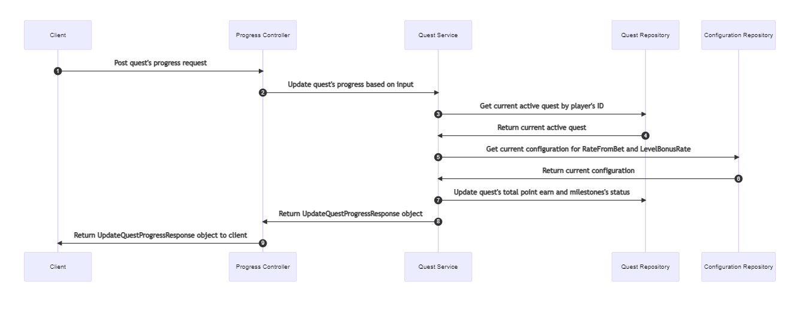

# PlayStudio Coding Challenge
This is my PlayStudio Coding Challenge API project that provides API services that will be called by the game to progress and get state of a player's quest.
## Getting started ##
 - In order to run this project, you should install essential tools such as Visual Studio and MongoDB (maybe MongoDB Compass if you want to view data in the DB). 
 - Open the project with Visual Studio and run it by pressing F5, and a Swagger screen will pop up in the browser so that you can test it.
 - If your MongoDb isn't listening on port 27017, you'll need to update the connectionString in appsettings.json 's "MongoDatabase" section.
## Testing ##
 - Data will be seeded at the time you build the project so that you don't need to create data yourself (The seeding process will be skipped if documents already exist).
 - After the project is built, you can test it via the Swagger
 - You'll need to connect to MongoDb to retrieve an existing player's ID, which is required by two API services.
## Sequence diagram of milestone


## Quest Configuration
 There are two sets of configurations contained in the configuration document. After building the project, these configurations will be added to MongoDb.
#### Rate from bet: 
When the number of chips bet at least equals the MinimumBet, the amount is multiplied by the corresponding rate.
```
    [
     ...
         {
           "MinimumBet": [int],
           "Rate": [int]
         }
     ...
    ]
```
#### Level Bonus Rate: 
When your player reaches a certain level, you will receive a bonus chip based on Level and corresponding BonusRate.
```
    [
        ...
          {
            "Level": [int],
            "BonusRate": [int]
          }
        ...
    ]
```
## Quest Schema
```
{
    "_id": [id],
    "Player": {
        "_id": [id],
        "Name": [string],
        "Level": [int]
    },
    "Name": [string],
    "PointEarned": [int],
    "PointToComplete": [int],
    "NumberOfMilestones": [int],
    "IsComplete": [bool],
    "IsActive": [bool],
    "Milestones": [{
        "Index": [int],
        "Name": [string],
        "PointToComplete": [int],
        "Award": [int],
        "IsComplete": [bool]
    }]
}
```
#### Explanation:
- id: Quest's ID in the DB
- Player: Object contains info about the player
- Name: Quest's name
- PointEarned: Number of points that a player has in this quest
- PointToComplete: Number of points that a player needs to complete this quest.
- NumberOfMilestones: Maximum number of milestones in this quest
- IsComplete: Completion status of this quest
- IsActive: Active status of this quest
- Milestones: Set of milestones for this quest
